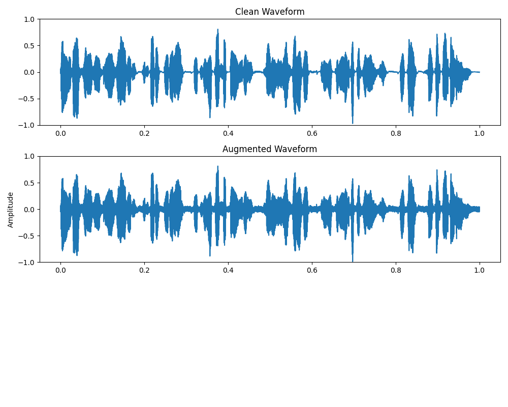
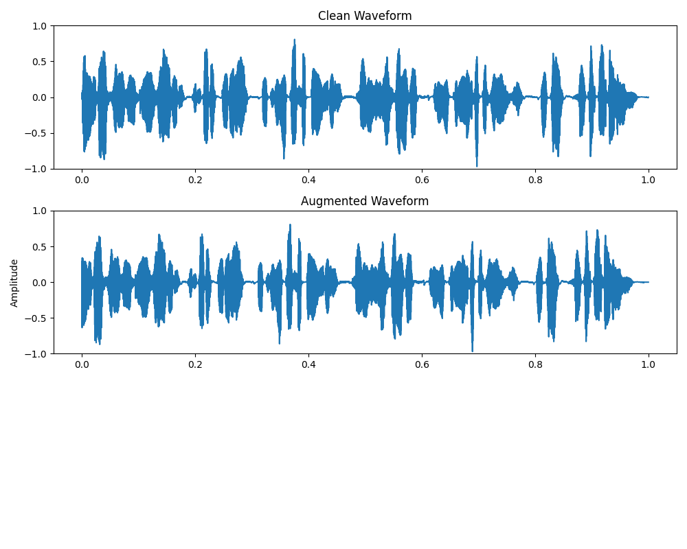
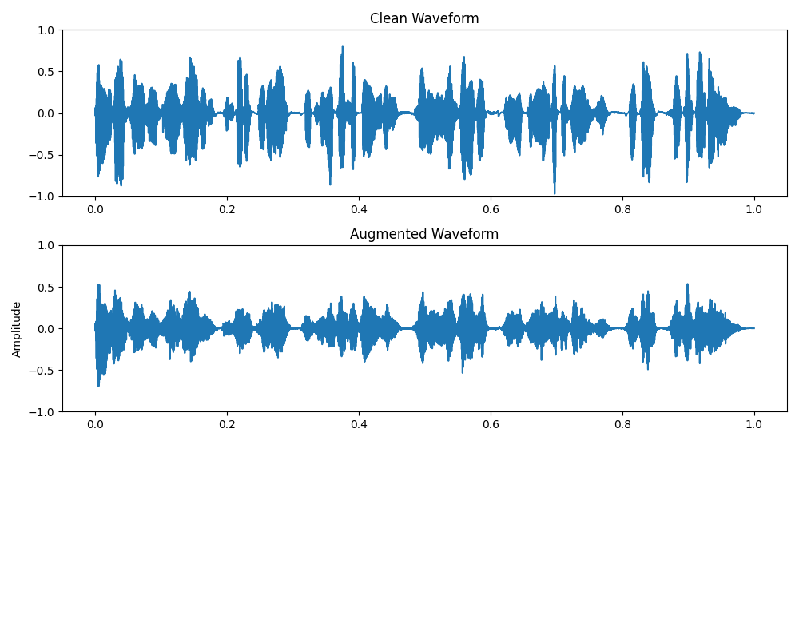
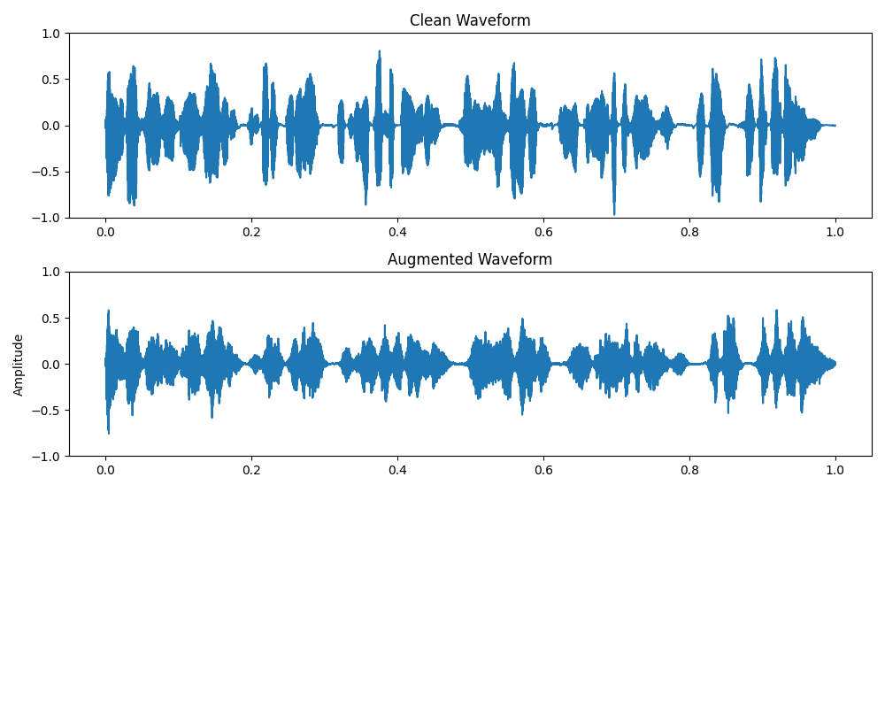
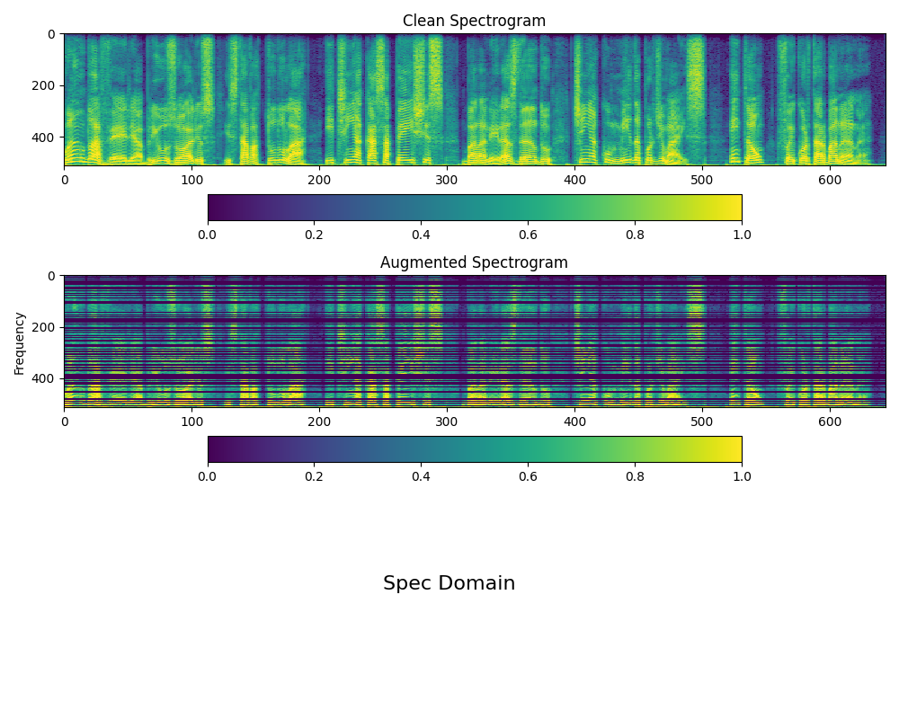
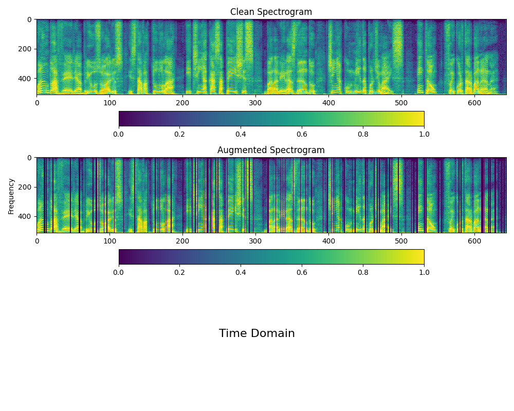
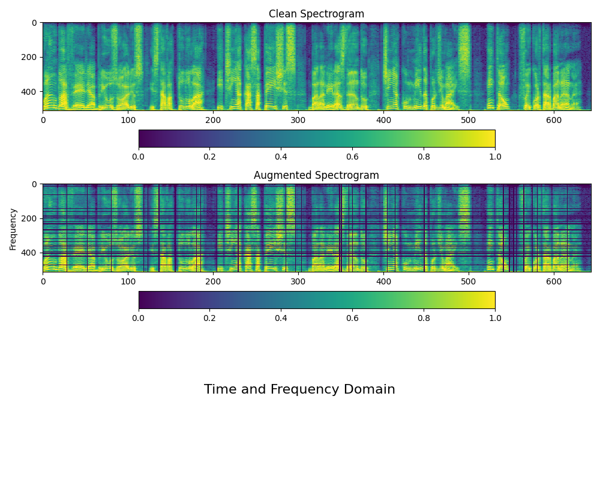

# Data Augmentation for Automatic Speech Recognition (ASR)
You can you this repository to generate syntactic data for ASR models. There are two main classes, called:
- AudioAugmentation
- SpecAugmentation

A third class unites the functions of the two classes and facilitates the work of data augmentation:
- DataAugmentation

## Noise Datasets

Download one of these datasets or all of them:

- Urban Sound  8k
[https://urbansounddataset.weebly.com/urbansound8k.html]

- FSDnoisy
[http://www.eduardofonseca.net/FSDnoisy18k/]

- ESC-50
[https://github.com/karolpiczak/ESC-50]

- ASR Noises
[https://github.com/snakers4/asr-noises]

## Noise Datasets Preprocessing

Convert noise files to the same sample rate as your dataset

```sh
python scripts/convert_sample_rate.py -i dataset_noises/ --sr 16000 --force
```

Generate a list of noise files:

```sh
find ./dataset_noises -name *.wav > noises_list.txt
```

## Configuring

There are three types of configuration:
- light
- moderate
- heavy

There are five options for data augmentation in the time domain:
"noise", "pitch", "stretch", "external_noise", "shift"

And two in the frequency domain, time masking and frequency masking, defined by:
"freq_mask",

Choose the options you want in the corresponding configuration file, defining the variable as follows:

```sh
"aug_options": ["noise", "pitch", "stretch", "external_noise", "shift", "freq_mask"],
```
Each setting (light, moderate or heavy) defines different intensities of the data augmentation options.

## Executing

```sh
python main.py -d clean_dataset_path -i metadata.csv -c config/config_file.json  -o noisy_dataset_output_path
```

## Audio Augmentation Examples
This class allows you to apply the following data augmentations:
- noise injection


- shifting time 


- changing pitch 


- changing speed


Based on the following works:
- [https://medium.com/@makcedward/data-augmentation-for-audio-76912b01fdf6]
- [https://www.kaggle.com/CVxTz/audio-data-augmentation]
- [https://github.com/alibugra/audio-data-augmentation]

## Spectrogram Augmentation
In the spectrogram domain, you can apply:

- frequency masking


- time masking


- both


Based on Google work:
- [https://arxiv.org/abs/1904.08779]
- [https://www.kaggle.com/davids1992/specaugment-quick-implementation/]

## Contact
- Frederico Santos de Oliveira (fred.santos.oliveira (at) gmail.com)

## Some Great Works
- [https://github.com/nxbyte/PythonAudioEffects]
- [https://github.com/facebookresearch/WavAugment]